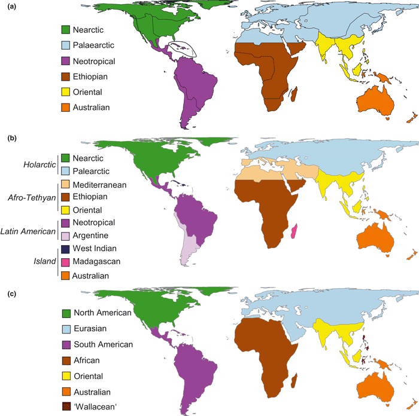
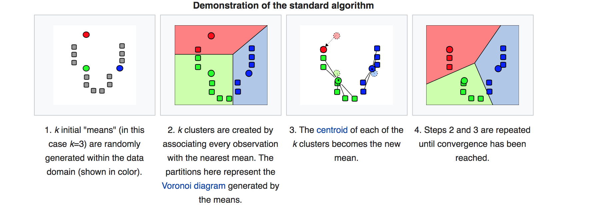
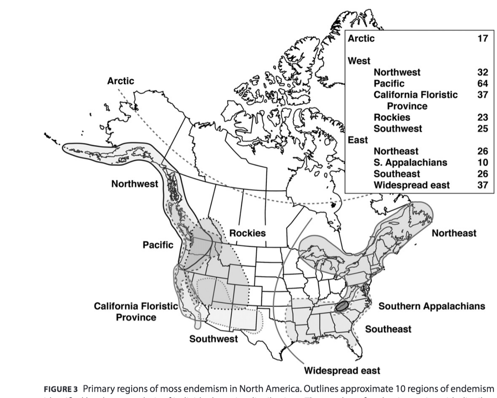

```{r, echo =F }
# function to colorize 
f <- function(x,n=10, pal, rev = F){
  if(rev == F){ 
    rev(RColorBrewer::brewer.pal(n, pal))[cut(x,n)]
  }else{
    (RColorBrewer::brewer.pal(n, pal))[cut(x,n)]
  }
}
```

## Before you start 

Make sure you have the following R packages installed 


```{r, message=FALSE}
library(igraph)
library(vegan)
library(raster)
library(rworldmap)
library(betapart)
library(RColorBrewer)
library(stringr)
library(maps)
```

Remember that you can install packages in R with `install.packages("package name")`

## Tutorial objectives 

1) Understand the basis of biogeographical regionalization
2) Quantify spatial turnover of communities
3) Deliniate biogeographic regions
4) Model climate envelopes 


# Biodiversity 


-------


# Biogeographic regions

- The characterization of geographical areas in terms of biodiversity.

- Areas with distinct evolutionary stories. 

- Comprehensive understanding of the drivers of biological organization





# Global biodiversity databases 

Since early societies, people have been interested to study the distribution of life in the planet. In the illustration age, Carl Linnaeus and other natural historians like Humboldt, Wallace, and Darwin sistematized the study of biodiversity distribution. Since then, centuries of scientific research produced invaluable information on biodiversity. Nowadays, this corpus of biodiversity knowledge is being aggregated into large-scale datasets which are freely available in the internet. For example, digital information infrastructures such as the Global Biodiversity Information Facility (GBIF) increases the accesiblity of data on the distribution of life across the planet. These, digitally available data have various origins such as biodiversity inventories, field research reports, field observations, citizen science, etc.


## Format and standards 

There are two main ways how the geographic distribution of species is digitally stored in databases. 

1) geocoded species observations

This is a simple format to store information on species distribution. At the minimal level a geocoded point involves tree variables which are the 2 spatial coordinates and the species' (or other taxonomic category) name. This format is probably the most common way which information in the geography of biodiversity is stored in the globe. This simple format make it easy to store and takes little space in memory. However, relying only on geocoded points has is limitations. For instance the spatial patterns can be strongly because of sampling effort. For poorly sampled species, a single new observation can dramatically increase the extent of the species geographic distribution. Similarly, the sparsity of observations may influence community similarity measures. This problem is particularly accentuated in biodiversity rich and/or poorly sampled regions of the globe such as the tropics, mountains, or near the poles. 

2) Species ranges 

The delineation of species geographical ranges is second commonly used format to store information on species distribution. Instead of points, species ranges represent a portion of any representation of the geographical surface of the planet. The delineation is often done based the information on species point data + climate models + expert knowledge. Digital information of species ranges usually come stored as vector polygons or rasters. For instance, a common format is the convex hull, which is the smallest set in space that includes all the species points. More sophisticated methods, such as species distribution modelling uses climatic variation to infer species environmental niches by modelling probabilities of species occurrences in space. Conservation agencies such as the IUCN use this species distribution models along taxonomic and local experts to delimit a more continuous surface to represent the spatial range of a species. Species ranges hold more information than geocoded points at the species level, however biodiversity information at this level of detail is only available for a limited number of taxa. 


```{r, echo = F,fig.align='center', fig.height=4}

MyGC <- data.frame("x" = sample(seq(1,40,1),10),
                   "y" = sample(seq(-1,-40,-1),10), 
                   "sp" = replicate(10,paste("Sp", sample(1:5,1))))


knitr::kable(MyGC)

par(mfrow = c(1,2))
plot(MyGC$x, MyGC$y, 
     frame = F,
        main = "Point occurrences",
     pch = 16,
     xlab ="x",
     ylab = "y")

plot(MyGC[,1:2], 
     frame = F, 
     xlab = "x",
     main = "Convex hull range",
     pch = 16,
     ylab = "y")
X <- MyGC[c(1:5),c(1:2)]
hpts <- chull(X)
hpts <- c(hpts, hpts[1])
lines(X[hpts, ], col = "red")

X <- MyGC[c(6:10),c(1:2)]
hpts <- chull(X)
hpts <- c(hpts, hpts[1])
lines(X[hpts, ], col = "blue")

```


https://www.iucnredlist.org/species/172220/6852079


https://www.iucnredlist.org/species/173248/6979817


# Quantifying biodiversity gradients

##  The region of interest (R.O.I)

The region of interest corresponds to the space encompassing the sum of the biodiversity total variance. The ROI is the space which we are interested to classify into definable regions based on its biodiversity.

```{r, echo = F, out.width="50%", fig.cap="A region of the space V is composed by the set of points in the neighborhood around a point p located at the space V"}
knitr::include_graphics("https://upload.wikimedia.org/wikipedia/commons/7/79/Neighborhood_illust1.svg")
```

Depending of the research question or because information limitation, researchers often limit the region of interest to an extent. Boundaries for a region of interest can be placed in geographical space, climatic space, across a temporal axis, and to particular taxonomic groups. 

```{r, echo = F,fig.align='center', fig.show="hold", out.width="80%"}

g <- graph_from_literal(ROI-+Space, 
                        ROI-+Time,
                        Space-+Global, 
                        Space-+Subset, 
                        Subset-+Political,
                        Subset-+Environment, 
                        Environment-+Topography, 
                        Environment-+Climate, 
                        Time-+Evolutionary, 
                        Time-+Cycles)

l <- layout_as_tree(g)

plot(g, layout = l, vertex.shape = "none")

```


## The species-site matrix. 

This matrix holds information on the presence/absence or relative abundances of a set of species throughout a series of localities (sites). In our tutorial, the sites correspond to each of the 1x1 degree grids. For this tutorial we will focus only on the aspect of biodiversity change that comes from the variance of species presences and absences in the ROI. Therefore, entries in the species-site matrix are coded as 1 if a species $j$ is present at a grid $n$, and 0 otherwise. Row vectors of this matrix represent the spatial variation of each species across the ROI. Column vectors represent the composition of a site in terms of species. 

$$\begin{bmatrix}  & site1 & site2 & ... & site_n 
\\Sp1 & 1 & 0 & ...& 1
\\Sp2 & 0 & 1  & ...& 1
\\Sp3 & 1 & 1  & ...& 0
\\Sp4 & 1 & 0 & ...& 1 
\\\vdots & \vdots & \vdots & \vdots & \vdots 
\\Sp_j & 1 & 1 & 1 & 0
\end{bmatrix}$$


### Resolution

Resolution and scale is important to consider before we start to examine biodiversity variation in space. Importantly, because of data limitation at larger scales often is necessary to aggregate point pattern data. The chosen grid resolution both at the area and limits can influence the overall patterns we may be able to identify.  

*Discussion point:*

**How different choices of grid resolution affect our observations of spatial patterns in biodiversity?**

**What is the relationship between resolution and scale?**


```{r, echo = F,out.width="70%", fig.cap="Resolution"}
knitr::include_graphics("https://carto.com/blog/img/posts/2018/2018-01-09-tile-aggregation/aggr.png")
```


##  Community dissimilarities

This differences in species composition is commonly known as species turnover and it is a separate component (ß) of biodiversity. We will compute pairwise dissimilarities in grid species composition. Pairwise dissimilarities in species composition among communities are in function of the number of shared species and the sum of the species diversity of a pairwise set of communities. There are several metrics of community dissimilarity. I encourage you to explore that further in your own. In this tutorial we will use the Simpson dissimilarity index as a measure of species turnover. 

$$ S_i = \frac{a}{a + min(b,c)} $$


being $a$ the number of shared species and $min(b,c)$ the minimum number of species between two communities.  

There are several advantages of Simpson dissimilarity index relative to other indexes. For instance Simpsons uses only the poorest community in the denominator to account for large differences in richness between communities. This means that the index is not biased by strong richness differences between sites, therefore removing the contribution of nestedness to the pairwise dissimilarities 

**High nestedness**

$$\begin{bmatrix}  & site1 & site2 & site_3 
\\Sp1 & 1 & 1  & 1
\\Sp2 & 1 & 1  & 1
\\Sp3 & 1 & 1  & 0
\\Sp4 & 1 & 1  & 0 
\\Sp5 & 1 & 1  & 0 
\\Sp6 & 1 & 0  & 0 
\\Sp7 & 1 & 0  & 0
\\Sp8 & 1 & 0  & 0 
\\Sp9 & 1 & 0  & 0 
\end{bmatrix}$$


**High turnover**

$$\begin{bmatrix}  & site1 & site2 & site_3 
\\Sp1 & 1 & 1  & 1
\\Sp2 & 1 & 1  & 1
\\Sp3 & 1 & 1  & 0
\\Sp4 & 1 & 1  & 0 
\\Sp5 & 0 & 1  & 0 
\\Sp6 & 0 & 1  & 0 
\\Sp7 & 0 & 1  & 0
\\Sp8 & 0 & 0  & 1
\\Sp9 & 0 & 0  & 1 
\end{bmatrix}$$


# Defining biogeographic regions

Biogeographic regions are defined by the variance of the species dissimilarities among sites. There are two main ways how we can approach this problem of linearizing multidimensional variation in community dissimilarities to define biogeographic regions. We can classify or communities into discrete categories or continuously ordinate them in fewer multivariate dimensions. 


## Discrete partitioning

### K-means clustering 

K-means algorithm assumes euclidean distances to compute k clusters. Simpson dissimilarity index index does not project linearly into euclidean space. The **Hellinger** standardization is a workaround which let's us use euclidean metrics with community dissimilarity metrics.  

$$y_{i,j} = \sqrt{\frac{y_{i,j}}{y_i}}$$


k-means is a fast clustering algorithm. The k-means algorithm searches to partition the variance of a matrix into groups of *k* clusters centered around *k* means.

This is common methodology for *un-supervised" classification tasks. That is, we let the data to tell us the best partition into separate classes. 

```{r, echo = F, out.width="150%", fig.align='center',fig.cap="steps for the K-means algorithm (from wikipedia)"}


```

### selecting an optimal k

The main limitation of the k-means algorithm is that the cluster association vector is always dependent on the values of *k*. How do we know the best *k* then?. This therefore becomes an optimization problem for the value of *k*. 

A solution to find the best *k* is to iterate the k-means algorithm for a series of *k* within a range of reasonable estimate for the number of clusters given our community matrix. (e.g k << S or k < S not k = S or k > S)

We optimize the ratio between the variance within *k* given clusters in relation with the total amount of variation in the matrix.  We select the  *k* parameter which the sum of squares of the distances between *k* clusters (i.e. the distances of the k-centroids to its mean centroid) is closest to the sum of squares of the whole matrix. 


## Dimensionality reduction

Dimensionality reduction comprise various statistical techniques which looks to fit as much variance possible into the first few of a set of orthogonal linear multivariate vectors. There are various parametric techniques for dimensionality reduction, being Principal component analysis (PCA) among the most widely use. Non-parametric techniques also exist such as the Non-Metric Multidimensional (NMDS), which finds the most parsimonious arrangement into planar space that preserve the community wide pattern of pairwise distances among entries in a matrix.


*Principal component analysis*
  
  http://ordination.okstate.edu/overview.htm

  https://wiki.qcbs.ca/r_workshop9

*Non-metric multidimensional scaling NMDS:* 

  http://www.flutterbys.com.au/stats/tut/tut15.1.html

  http://cc.oulu.fi/~jarioksa/opetus/metodi/vegantutor.pdf


## Spectral partitioning

The species-site matrix can also be conceptualized as a bipartite graph. In this graph, Vertices (nodes) are either species or sites. Edges (links) connect vertices based on the occurrence of a given species in a site. This is called a bipartite graph because edges connect nodes that belong to a different set. That is, edges in this graph exist between species and sites but not among species, nor sites. A graph representation opens up various possibilities to examine the structure of species turnover across space. 


**Incidency matrix**

$$ G = \begin{bmatrix}  & site1 & site2 & site3 & site_3 
\\Sp1 & 1 & 0 & 1& 1
\\Sp2 & 0 & 1  & 0& 1
\\Sp3 & 1 & 1  & 1& 0
\\Sp4 & 1 & 0 & 1 & 1 
\\Sp_5 & 1 & 1 & 1 & 0
\end{bmatrix}$$

**Bipartite graph**

```{r, echo = F, message = F}
grr <- t(matrix(c(1,0,1,1,0,1,0,1,1,1,1,0,1,0,1,1,1,1,1,0),4,5))
colnames(grr) <- paste0("Site", c(1:4))
rownames(grr) <- paste0("Species", c(1:5))
grr <- reshape2::melt(grr)[reshape2::melt(grr)$value >0,]
grah <- igraph::graph.data.frame(grr, directed = F)


V(grah)$type <- c(rep(1,5), rep(0,4))


l <- igraph::layout.bipartite(grah)
plot(grah,
     vertex.shape = c(rep("circle",5),rep("square",4)),
     layout=l)


```

**Adjacency matrix = A** 

```{r, echo = F}
A <- as.matrix(igraph::as_adjacency_matrix(grah))
knitr::kable(A)
```


*Degree matrix = D*

```{r, echo = F}

D <- diag(degree(grah))

colnames(D) <- c(paste0("Species", c(1:4)), paste0("Site", c(1:5)))
rownames(D) <- c(paste0("Site", c(1:5)), paste0("Species", c(1:4)))

knitr::kable(D)
```


**Laplacian matrix = L**


$$ L = D-A $$
```{r, echo = F}
L <- as.matrix(igraph::laplacian_matrix(grah))
knitr::kable(L)
```


**Spectral profile of a graph**


```{r, echo = F}

gp <- igraph::bipartite.random.game(10,20, p = 0.25, directed = F)
Isolated <- which(degree(gp)==0)
gp <- delete.vertices(gp, Isolated)

small <- length(V(gp))-1

m2ev <- igraph::spectrum(gp, which = c("LM", howmany = 4))$vectors

evL <- eigen(igraph::laplacian_matrix(gp))$vectors


par(mfrow = c(2,3), mar = c(1,1,3,1))

igraph::plot.igraph(gp, 
                    vertex.label = NA,
                    main = "Bipartite graph",
                    vertex.shape = c(rep("square", 10), rep("circle",20)),
                    layout = igraph::layout.bipartite(gp))
l =  igraph::layout.fruchterman.reingold(gp)
igraph::plot.igraph(gp, 
                    vertex.label = NA,
                    vertex.shape = c(rep("square", 10), rep("circle",20)),
                    main = "Force directed graph",
                    layout = l)


igraph::plot.igraph(gp,
                    vertex.label = NA, 
                    layout = l,
                    main = "Symmetry",
                    vertex.shape = c(rep("square", 10), rep("circle",20)),
                    vertex.color = sign(evL[,small])+2) 

igraph::plot.igraph(gp,
                    vertex.label = NA, 
                    main = "Connectivity",
                    layout = l,
                    vertex.shape = c(rep("square", 10), rep("circle",20)),
                    vertex.color = f((evL[,small]), 6, "Spectral"))


igraph::plot.igraph(gp,
                    vertex.label = NA, 
                    layout = l,
                    main = "Generality",
                    vertex.shape = c(rep("square", 10), rep("circle",20)),
                    vertex.color = f((evL[,1]), 4, "Spectral", T))

igraph::plot.igraph(gp,
                    vertex.label = NA, 
                    layout = l,
                    main = "Centrality",
                    vertex.shape = c(rep("square", 10), rep("circle",20)),
                    vertex.color = f((evL[,2]), 4, "Spectral", T))


```


# Case study


For this tutorial we will quantify on the spatial turnover of bryophyte communities across the US and Canada. Bryophytes are non-vascular plants that occur in many habitats across the globe. Bryophytes include liverworts, mosses, and hornworts. Bryophytes have been sampled extensively in various regions of the Atlantic and Pacific zones of Canada and the United States. Recently, the  Beaty Museum of the University of British Columbia made available the information on their entire collection of bryophyte occurrences. The dataset is freely available through GBIF. 


I previously downloaded the dataset from the GBIF, if you want to download it yourself it is here: https://www.gbif.org/dataset/4edd9396-59df-4b01-9e29-dc21a59f9963


```{r, echo = F, fig.height=4}
knitr::include_graphics("https://upload.wikimedia.org/wikipedia/commons/d/d1/Hornwort_%283144429129%29.jpg")
```

This dataset comes from the bryophyte collections of the University of British Columbia. 

https://beatymuseum.ubc.ca/research-2/collections/herbarium/herbarium-bryophytes/

## Loading the dataset 

Let's load the dataset, which is currently in the data folder stored as a .csv file. 

```{r}
briofCan <- read.csv("data/BriophitesCAN.csv", 
                     header = T,
                     sep = "\t") # note we are specifing a tab-delimited file. 

head(briofCan)

length(unique(briofCan$speciesKey))
length(unique(briofCan$scientificName))
```

Let's observe the geographic information contained in the dataset

```{r, cache=F,fig.align='center', fig.height=4}
plot(briofCan$decimalLatitude~ briofCan$decimalLongitude, 
     pch = ".", 
     frame = F,
     main = "Bryophytes recorded in dataset",
     xlab = "Long",
     ylab = "Lat")
```

## Dataset housekeeping

The raw dataset is extensive, and there are some data which is obviously misplaced. 

We must have a clean version of the dataset before we start doing any analyses on it. 

Let's start by removing all fields that have no associated geographic information. 


```{r}
coords <-  data.frame("x"=briofCan$decimalLongitude, 
                      "y"=briofCan$decimalLatitude)
# only georeferenced recors 
briofCan <- briofCan[complete.cases(coords),]

```

Second, let's set our ROI within the continental political boundaries of Canada and the United States of America to do some more housekeeping. 

```{r,fig.height = 4,fig.align='center'}
# subset coords

US_CAN <- countriesLow[countriesLow$SOVEREIGNT %in% c("Canada", "United States of America"),]

coords <- coords[complete.cases(coords),]
code <- over(SpatialPoints(coords,
                           proj4string = crs(US_CAN)),
             US_CAN)$POSTAL
coords$code <- code 
briofCanClean <- briofCan[coords$code %in% c("CA", "US"),]
briofCanClean <- droplevels(briofCanClean[briofCanClean$phylum == "Bryophyta",])

# clean hawai (to keep records only at the continental shelf)
briofCanClean <- briofCanClean[briofCanClean$decimalLatitude > 30 & briofCanClean$decimalLongitude <0,]

# How many observations are we left with?
length(unique(briofCanClean$speciesKey))
length(unique(briofCanClean$scientificName))

# let's plot the geographic distribution of the clean data
plot(decimalLatitude~ decimalLongitude, 
     xlab = "Longitude",
     ylab = "Latitude",
     pch =  15,
     cex = 0.1,
     col = "red",
     data = briofCanClean,
     frame = F)
maps::map(regions = c("USA", "Canada"),fill = F,
          col = "black",
          add = T)
```


### Where to get data to limit the R.O.I. ? 


These are some sources of information on planetary scale geographical limits.

- https://www.usgs.gov/

- https://datasetsearch.research.google.com/

- https://www.worldclim.org/

- http://www.fao.org/geonetwork/srv/en/main.home?uuid=ac02a460-da52-11dc-9d70-0017f293bd28

- https://www150.statcan.gc.ca/n1/pub/71-607-x/71-607-x2020010-eng.htm?HPA=1

- https://developers.google.com/earth-engine/datasets

- https://www.gmba.unibe.ch/

- https://www.naturalearthdata.com/


## Aggregating species occurrence to grids in geographical space

For this tutorial we will define biogeographic regions using a spatial resolution of 1x1 degree. This means that we will consider all species in a grid as separate biological "communities". It is important to discuss the ecological implications of this assumption. For instance, we can question whether the variation in grids represents accurate representations of the ecological forces defining the coexistence of species into communities. Similarly, we can question whether the biodiversity variance is homogeneous across all grids. For example, within grid variance is expected to be high in biodiversity rich areas such as the tropical rain forest in contrast to biodiversity poor regions such as desserts. For continental scale studies 1x1 degree is often a standard.

```{r,fig.height= 4,fig.align='center'}
range(briofCanClean$decimalLatitude)
# lets round to 1 degree... 

briofCanClean$latRound <- round(briofCanClean$decimalLatitude)
briofCanClean$lonRound <- round(briofCanClean$decimalLongitude)
# get a unique id to identify each grid
briofCanClean$unID <- paste(briofCanClean$latRound,
                            briofCanClean$lonRound, 
                            sep = "_")
plot(briofCanClean$lonRound,
     briofCanClean$latRound, 
     xlab = "Longitude",
     ylab = "Latitude",
     pch =  15,
     cex = 0.4,
     col = "firebrick", 
     frame = F)
maps::map(regions = c("USA", "Canada"),
          fill = F,
          col = "black",
          add = T)
```


### Species-site matrix


```{r}
gridTab <- table(briofCanClean$unID,
                 briofCanClean$speciesKey )

gridTab2 <- gridTab # sampling effort
gridTab[gridTab > 1 ] <- 1 # p/a
```

### Richness distribution and sampling biases


```{r}
res <- residuals(lm(c(gridTab)~c(gridTab2)))

resMat <- matrix(res, nrow = nrow(gridTab),ncol =  ncol(gridTab))
colnames(resMat) <- colnames(gridTab)
rownames(resMat) <- rownames(gridTab)
```

```{r, fig.height = 4, fig.align='center'}

plotAmap <- function(gridTab, main ){
  
  dat <- data.frame(
    "div"= rowSums(gridTab),
    data.frame(
      apply(stringr::str_split(rownames(gridTab),
                               "_", simplify= T),
            2,
            as.numeric)
    )
  )
   
   
   plot(dat$X2, dat$X1, 
        main = main,
        pch = ".",
        yaxt = "n",
        xaxt = "n",
        frame= F,
        xlab = "Long", 
        ylab= "Lat",
        col = f(dat$div, 7, "Reds", T),
        cex = log(abs(dat$div)))
   
   maps::map(regions = c("USA", "Canada"),
          fill = F,
          col = "black",
          add = T)
    
}

par(mfrow = c(1,2), mar = c(0,0,4,0))
plotAmap(gridTab, main = "Richness distribution")
plotAmap(resMat, "Richness corrected by effort")
```

## Community dissimilarities


Let's define a function to compute this Simpson similarity index and apply it to our data to obtain a dissimilarity matrix .


```{r}
# Function to compute the simpson dissimilarity index among sites in our matrix and return a dissimilarity matrix 
# param: SpTab = species-site matrix 

getDisMat <- function(SpTab){
  # How to measure similarity? 
  # presence-absence 
  SpTabPA <-SpTab
  SpTabPA[SpTabPA>1] <- 1
  
  # Simpson dissimilarity index 
  
  # Calcualate "simpson dissimilarity index" (Bsim part of sorensen dissimilarity)
  part <- betapart::beta.pair(SpTabPA,
                              "sorensen")
  # summary(part$beta.sim) ##  access the portion of the object that correspond to the Simpson index of dissmilarity 
  
  distMat <- part$beta.sim
  
  return(distMat)
  
  
}

distMat <- getDisMat(gridTab)


```


Lets observe the variance of the dissimilarity matrix, how many clusters can you observe by eyeballing a heatmap?

```{r}

heatmap(as.matrix(distMat))

```


## Dissimilarity decay fields 

```{r varvec, cache=T, fig.height = 10, fig.align='center'}
# visualize single dimensions in space. 
# compute the variance of grids
varVec <- sapply(1:nrow(as.matrix(distMat)), function(x) var(as.matrix(distMat)[,x]))

plotFocalPoint <- function(distMat, varVec){
  focalPoint <- data.frame("FP"= as.matrix(distMat)[,which(varVec == sample(varVec,1))])
  
  distPlot <- data.frame(stringr::str_split(
    rownames(focalPoint), 
    "_",
    simplify = T),
    "dist" =  focalPoint[,1])
  names(distPlot) <- c("lat", "lon", "val")
  distPlot <- data.frame(
    apply(distPlot,
          2,
          as.numeric))

  plot(distPlot$lat~distPlot$lon,
       xlim = c(-170,-50),
       ylim  = c(20,90), 
       xaxt = "n", 
       yaxt = "n", 
       xlab = "",
       ylab  = "",
       pch = 15, cex = 0.5)

  
  maps::map(regions = c("USA","Canada"),
            fill = T,
            col = "white",
            add = T)
  
  points(distPlot$lat~distPlot$lon,
         pch = 16, 
         cex = 0.7,
         col = scales::alpha(
           f(log(distPlot$val+1), 
             9,
             "YlOrRd", T), 
           1-log(distPlot$val+1)))
  maps::map(regions = c("USA", "Canada"),
            fill = F,
            col = "black",
            add = T)
  
  
}


par(mfrow = c(4,2), mar = c(0,0,0,0), bg = "gray")

for(i in 1:8){
  plotFocalPoint(distMat,varVec)
}

```

### removing potential sources of noise

We must remember that we deal with incomplete records so there is the potential for non-ecologically relevant sources of variation. For instance, poorly sampled localities may inflate the total sum of pairwise dissimilarities, reducing our ability to disentangle patterns. There is not a magic number of grids or species to preserve but it rather depends to the study objectives, dataset characteristics, and study scale and resolution. 

```{r}

SpTab2  <- gridTab[rowSums(gridTab) > 10,
                 -which(colSums(gridTab) 
                        %in% c(1:2))]
distMat2 <- getDisMat(SpTab2)

```


## Discrete partitioning


```{r}
# standardize distances and apply k-means for a range of k. 
cascadeKM <- vegan::cascadeKM(vegan::decostand(distMat2, 
                                               "hellinger"), # standardization of distances
                              inf.gr = 2, # lowest k tested
                              sup.gr = 10) # highest k tested
```


Lets observe the change on the sum of squares and the similar Calinski criterion  after applying the k-means for a range of $k={2,3,4,5,6,7,8,9,10}$

```{r, echo=F, fig.height=4,fig.align='center'}
par(mfrow = c(1,2))
plot(2:10,c(cascadeKM$results[1,]), ylab = "SSE")
plot(2:10,c(cascadeKM$results[2,]), ylab = "Calinski")
```


```{r}
KM2 <- cascadeKM$partition[,1]
KM3 <- cascadeKM$partition[,2]
KM4 <- cascadeKM$partition[,3]
KM <- data.frame(KM2,
                 KM3,
                 KM4,
                 apply(stringr::str_split(names(KM2),
                                          pattern = "_", 
                                          simplify = T),
                       2, as.numeric)
                 )
head(KM)
```


```{r, echo = T, fig.height = 4,fig.align='center'}

par(mfrow = c(2,2), mar = c(1,1,1,1))
plot(KM$X2, KM$X1,
     col = f(KM$KM2, 2, "Accent"),
     pch = 1,
     xaxt = "n",
     yaxt = "n",
     main = "k = 2",
     frame = F,
     ylab = "Lat",
     xlab = "Long",
     cex = 0.35)
maps::map(regions = c("USA", "Canada"),
          fill = F,
          col = "black",
          add = T )


plot(KM$X2, KM$X1,
     col = f(KM$KM3, 3, "Accent"),
     pch = 1,
     xaxt = "n",
     yaxt = "n",
     frame = F,
     main = "k = 3",
     ylab = "Lat",
     xlab = "Long",
     cex = 0.35)
maps::map(regions = c("USA", "Canada"),
          fill = F,
          col = "black",
          add = T )


plot(KM$X2, KM$X1,
     col = f(KM$KM4, 4, "Accent"),
     pch = 1,
     frame = F,
     xaxt = "n",
     yaxt = "n",
     main = "k = 4",
     ylab = "Lat",
     xlab = "Long",
     cex = 0.35)
maps::map(regions = c("USA", "Canada"),
          fill = F,
          col = "black",
          add = T )


```


## Dimensionality reduction


```{r, fig.height = 4, fig.align='center', message = F}
# PCA
vrda <- vegan::rda(SpTab2)
# NMDS 
mds <- vegan::metaMDS(distMat2)

par(mfrow = c(1,2))
plot(mds)
plot(vrda)
```


```{r}
# Extracting scores 
## Scores from PCA
Scor <- vegan::scores(vrda)$sites
# recreate coordinate names
nam <- apply(stringr::str_split(rownames(scores(vrda)$sites),
                                "_", simplify =T),2,as.numeric)
# build the dataframe
mdsScor <- data.frame(nam, Scor)
```


```{r, echo = T, fig.height = 4,fig.align='center'}

par(mfrow = c(1,2), mar = c(0,0,3,0))
cex = 0.7
plot(mdsScor$X1~ mdsScor$X2,
     cex = cex,
     pch = 15,
     xaxt = "n",
     yaxt = "n",
     xlab = "",
     main = "PCA1",
     ylab  = "",
     col = f(log(mdsScor$PC1+2), 5, "Set2"))
maps::map(regions = c("USA", "Canada"),fill = F,col = "black",
          add = T)
plot(mdsScor$X1~ mdsScor$X2,
     cex = cex,
     xaxt = "n",
     yaxt = "n",
     xlab = "",
     ylab  = "",
     main = "PCA2",
     pch = 15, col = f(log(mdsScor$PC2+7), 5, "Set2"))
maps::map(regions = c("USA", "Canada"),fill = F,col = "black",
          add = T)


```


## Spectral partitioning


```{r}
# Create a graph 
SpGraph <- igraph::graph_from_incidence_matrix(SpTab2)


# Spectrum of adjacency matrix

eiVal <- igraph::spectrum(
  SpGraph,
  which = list(pos = "LM", 
               howmany = 3)
  )

eiVal <- eiVal$vectors

par(mfrow = c(2,2), mar = c(4,4,2,2))
plot(eiVal[,1], eiVal[,3],
     pch = ".", cex = 2,
     col = c(rep("red", 466), rep("green", 903)))
plot(eiVal[,1], eiVal[,2], 
          pch = ".", cex = 2,
     col = c(rep("red", 466), rep("green", 903)))
plot(eiVal[,2], eiVal[,3], 
          pch = ".", cex = 2,
     col = c(rep("red", 466), rep("green", 903)))

```


```{r, echo = F, fig.height = 4,fig.align='center'}
par(mfrow = c(2,2), mar = c(1,1,1,1))
mdsScor <- data.frame(mdsScor, eiVal[1:dim(SpTab2)[1],])

names(mdsScor)[-c(1:4)] <- c("E1","E2", "E3")

cex = 0.35
plot(mdsScor$X1~ mdsScor$X2,
     xaxt = "n",
     yaxt = "n",
     xlab = "",
     ylab  = "",
     frame = F,
     main  = "1-eigenvector",
     col = f((mdsScor$E1),7, "Dark2"), 
     pch = 1, cex = cex)
maps::map(regions = c("USA", "Canada"),fill = F,col = "black",
          add = T)


plot(mdsScor$X1~ mdsScor$X2,
     xaxt = "n",
     yaxt = "n",
     xlab = "",
     ylab  = "",
      frame = F,
     main  = "2-eigenvector",
     col = f(mdsScor$E2,7, "Dark2"), 
     pch = 1, cex = cex)
maps::map(regions = c("USA", "Canada"),fill = F,col = "black",
          add = T)

plot(mdsScor$X1~ mdsScor$X2,
     xaxt = "n",
     yaxt = "n",
     xlab = "",
     ylab  = "",
      frame = F,
     main  = "3-eigenvector",
     col = f(mdsScor$E3,7, "Dark2"), 
     pch = 1, cex = cex)
maps::map(regions = c("USA", "Canada"),fill = F,col = "black",
          add = T)


```


```{r}
# Graph laplacian 

LapMat <- igraph::laplacian_matrix(SpGraph)

# Laplacian spectra

LapEig <- eigen(LapMat)

```


```{r}

dfV <- data.frame(mdsScor, LapEig$vectors[1:dim(SpTab2)[1],][,c(1,2,dim(SpTab2)[1]-1)])
names(dfV) <- c("X1", "X2", "PC1", "PC2", "Lap1", "Lap2", "Lap-2")
```


```{r, echo = T, fig.height = 4,fig.align='center'}

par(mfrow = c(2,2), mar = c(1,1,1,1))

cex = 0.35
col <- sign(dfV$`Lap-2`)+2

plot(mdsScor$X1~ mdsScor$X2,
     xaxt = "n",
     yaxt = "n",
     xlab = "",
     ylab  = "",
     frame = F,
     main  = "Symmetry",
     col = col, 
     pch = 1, cex = cex)
maps::map(regions = c("USA", "Canada"),fill = F,col = "black",
          add = T)
plot(mdsScor$X1~ mdsScor$X2,
     xaxt = "n",
     yaxt = "n",
     xlab = "",
     ylab  = "",
      frame = F,
     main  = "Connectivity",
     col = f(dfV$`Lap-2`, 7, "Dark2"),
     pch = 1, cex = cex)
maps::map(regions = c("USA", "Canada"),fill = F,col = "black",
          add = T)


plot(mdsScor$X1~ mdsScor$X2,
     xaxt = "n",
     yaxt = "n",
     xlab = "",
     ylab  = "",
      frame = F,
     main  = "Generality",
     col = f(log(abs(dfV$Lap1)), 8, "PuOr"),
     pch = 1, cex = cex)
maps::map(regions = c("USA", "Canada"),fill = F,col = "black",
          add = T)

plot(mdsScor$X1~ mdsScor$X2,
     xaxt = "n",
     yaxt = "n",
     xlab = "",
     ylab  = "",
      frame = F,
     main  = "Centrality",
     col = f(log(abs(dfV$Lap2)), 8, "PuOr"),
     pch = 1, cex = cex)
maps::map(regions = c("USA", "Canada"),fill = F,col = "black",
          add = T)


```


```{r, echo = F}
par(mfrow=c(2,3))
boxplot(mdsScor$E1~ KM$KM4,
        frame = F,
        xlab = "K-means groups",
        ylab = "1-Eigenvector")

boxplot(mdsScor$E2~ KM$KM4,
        frame = F,
        xlab = "K-means groups",
        ylab = "2-Eigenvector")

boxplot(mdsScor$E3~ KM$KM4,
        frame = F,
        xlab = "K-means groups",
        ylab = "3-Eigenvector")

boxplot(log(dfV$Lap1^2)~ KM$KM4,
        frame = F,
        xlab = "K-means groups",
        ylab = "1 lap.eigenvector")

boxplot(log((dfV$Lap2)^2)~ KM$KM4,
        frame = F,
        ylab = "2 lap.eigenvector",
        xlab = "K-means groups")

boxplot(log((dfV$`Lap-2`)^2)~ KM$KM4,
        frame = F,
        ylab = "-2 lap.eigenvector (log^2)",
        xlab = "K-means groups")

```


# Biogeographic regionalization in climatic space


```{r, cache = T}
WORLDCLIM  <-raster::getData("worldclim",
                             var="bio",
                             res=10 )
BIO1 <- (raster::intersect(WORLDCLIM$bio1,
                           SpatialPoints(data.frame(mdsScor$X2,
                                                    mdsScor$X1), 
                                         proj4string = WORLDCLIM$bio1@crs)))

BIO12 <- (raster::intersect(WORLDCLIM$bio12,
                            SpatialPoints(data.frame(mdsScor$X2,
                                                     mdsScor$X1), 
                                          proj4string = WORLDCLIM$bio1@crs)))


```


```{r}

climSpace = data.frame(coordinates(BIO1),
                       "BIO1" = getValues(BIO1))
climSpace2 = data.frame(coordinates(BIO12),
                        "BIO12" = getValues(BIO12))
climSpace$unID <- paste(round(climSpace$x),
                        round(climSpace$y),
                        sep = "_")
climSpace2$unID <- paste(round(climSpace2$x),
                         round(climSpace2$y), 
                         sep = "_")

climSpace$Bio12 <- climSpace2$BIO12[match(climSpace$unID, climSpace2$unID)]
climSpace <- droplevels(climSpace[complete.cases(climSpace),])

```


```{r}

colKM  = (KM$KM4[match(climSpace$unID, 
                       paste(KM$X2,
                             KM$X1,
                             sep = "_"))])
colCen  = mdsScor$E3[match(climSpace$unID, 
                       paste(KM$X2,
                             KM$X1,
                             sep = "_"))]

```


```{r, echo = T, fig.height=5, fig.align='center'}

par(mfrow = c(1,2))
plot(scale(climSpace$BIO1),scale(climSpace$Bio12),
   col = scales::alpha(f((colKM), 4,"Dark2"),0.5),
   cex = 0.7,
   pch = "+",
   main = "K-groups",
     xlab = "Mean annual temperature",
     ylab = "Mean annual precipitation",
     frame = F)

plot(scale(climSpace$BIO1),scale(climSpace$Bio12),
   col = scales::alpha(f((colCen), 7,"PuOr"),0.5),
   cex = 0.7,
   pch = "+",
   main = "3 Eigenvector",
     xlab = "Mean annual temperature",
     ylab = "Mean annual precipitation",
     frame = F)

```

```{r, echo = F, out.width="150%", fig.cap="Carter et al., 2016. Endemic regions of mosses in North America"}


```

